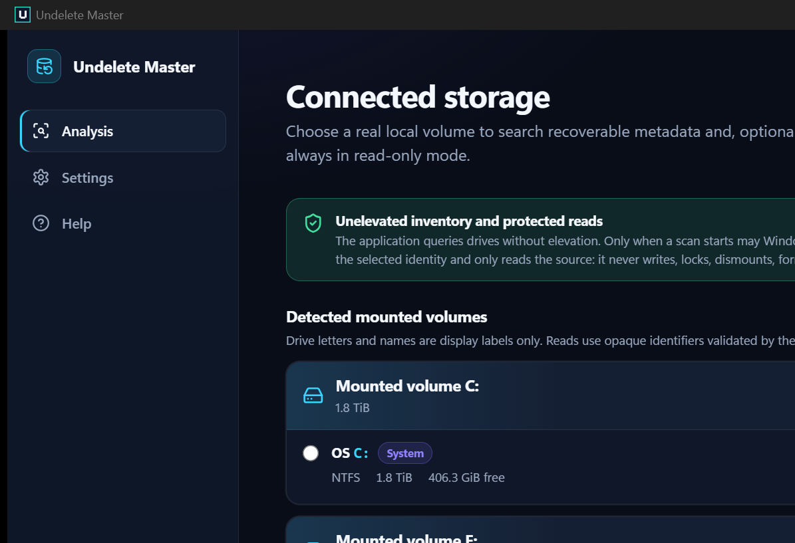

# Undelete Master

Undelete Master is a Windows-first, local data-recovery project focused on
source preservation and evidence-based results.

> **Development status:** the desktop can discover connected local storage,
> scan a selected mounted volume, and optionally restrict NTFS results to a
> selected folder. An explicit whole-volume NTFS mode also performs bounded
> contiguous-JPEG carving over bitmap-proven free space. The actionable results
> workspace and transactional restore workflow are implemented and locally
> fixture-verified, but packaged real-device acceptance is still unverified.
> Do not use this pre-release as the only means of recovering important data.

[Português do Brasil](README.pt-BR.md)

Documentation: [portal](docs/README.md) · [feature catalog](docs/FEATURES.md) ·
[real desktop screenshot gallery](docs/screenshots/README.md)



*Current packaged executable, real mounted-volume inventory, no mock data. See
the [screenshot provenance](docs/screenshots/README.md).*

## Quick start on Windows

### Prerequisites

- Windows 10 22H2 or Windows 11 on x64, with Microsoft Edge WebView2 available.
- A real, mounted local NTFS or FAT12/16/32 volume. NTFS is required for
  folder-scoped scans and for a recovery destination.
- Permission to approve Windows UAC when a scan starts. The desktop itself
  remains unelevated; only the fixed read-only broker is elevated.
- To recover files, a writable local NTFS folder on exactly one physical disk
  that is provably different from every physical disk backing the source.

Before scanning, stop using the source as much as practical. Every subsequent
write by Windows or another application can overwrite deleted content even
though Undelete Master itself opens the source read-only.

### Scan and recover

1. Start `undelete-master-desktop.exe` with its fixed sibling
   `undelete-master-broker.exe` in the same directory. Do not run the desktop
   as Administrator.
2. In **Analysis**, refresh the real connected-volume inventory and select the
   mounted volume to inspect. On NTFS, optionally choose a folder; the path
   remains native and is used as a proven-ancestry result filter.
3. Choose **Metadata** for the supported filesystem metadata scan, or **Deep
   JPEG** for the slower whole-volume NTFS scan of bitmap-proven free regions.
4. Start the scan and approve the broker's UAC prompt. During measurable MFT
   enumeration the UI reports real record counts, percentage, elapsed time and
   a rate-based ETA. Phases without a trustworthy total remain explicitly
   indeterminate; the application does not invent progress.
5. Search, filter and sort the bounded results. Select one candidate with its
   row checkbox, or use the header/select-matching action for a larger set.
6. Review the selection and choose **Recover selected**. Authorize a local NTFS
   destination on another physical disk, review any best-effort warning, then
   follow native item/byte progress through the terminal manifest.

The desktop intentionally has no image-file picker. The separate CLI accepts
ordinary local image files for engineering and headless workflows.

## Capability map

| Area | Current behavior |
| --- | --- |
| Source discovery | Real mounted local Windows volumes; inventory is unelevated |
| Metadata scan | NTFS and FAT12/16/32, with bounded and explicit partial evidence |
| Folder scope | Optional on NTFS; only candidates with proven ancestry are included |
| Deep carving | Contiguous structurally valid JPEG only, on a whole NTFS volume and only in `$Bitmap`-proven free ranges |
| Results | Native search, extension/evidence filters, stable sorting, cursor pages, individual and bulk selection |
| Recovery | Eligible metadata/content plans and implemented JPEG evidence; transactional preserve-tree output to a different physical NTFS disk |
| Headless CLI | Read-only scan of an ordinary local image file with sanitized JSON |
| Not supported | exFAT, ReFS, all-format or fragmented carving, damaged-filesystem RAW recovery, unmounted partitions and whole-physical-disk scanning |

## Implemented now

- A Rust `SourceReader` abstraction with no write operation.
- Real, unelevated Windows discovery of supported mounted volumes. The initial
  cards are logical storage groups; physical extents are deliberately resolved
  only inside the elevated broker after the user starts a scan.
- A real, unelevated Tauri 2 desktop application with no image-file picker,
  mock provider, fabricated result, or fake progress.
- Selection of a supported mounted volume and, on NTFS, an optional folder.
  The native path remains in Rust and never crosses IPC into the WebView.
- A short-lived, elevated, read-only Windows broker. It accepts only opaque
  volume identities and bounded reads, revalidates source identity, and has no
  write, trim, format, lock, dismount, restore, or generic device-command API.
- Defensive NTFS and FAT12/16/32 metadata scanning with bounded, paginated
  candidate results. NTFS enumeration reports quantitative MFT coverage and no
  longer stops at the former 64 MiB prefix. Folder-scoped NTFS results include
  only candidates whose ancestry can be proven; unknown ancestry is counted
  separately.
- An explicit deep-JPEG mode for a whole NTFS volume. It submits only ranges
  that a validated `$Bitmap` snapshot proves free, uses bounded incremental
  structural validation, and records physical range, SHA-256, validator
  version, coverage, and work-limit evidence. It never silently expands into
  allocated or unknown space.
- A backend-owned actionable results workspace with explicit search, dynamic
  extension facets, evidence filters, stable sorting, bounded cursor pages and
  native selection that survives page, query, filter and sort changes within
  the current process.
- Native scan phase events and an elapsed timer. MFT enumeration exposes real
  completed/total counts, a measured percentage and a rate-based ETA when its
  total is trustworthy; namespace, candidate-classification and deep-carving
  phases stay visibly indeterminate when they have no reliable total.
- A native transactional restore workflow for explicitly selected candidates.
  It requires an authorized NTFS folder on one proven different physical disk,
  preserves the recovered tree, renames collisions without replacing existing
  files, streams bounded reads, and publishes a versioned JSON manifest.
  Metadata-backed restoration does not depend on the filename extension when a
  usable content plan exists; that does not make every candidate recoverable or
  expand deep carving beyond its implemented JPEG plugin.
- Explicit best-effort consent and exact zero-filled-range sidecars for partial
  output. Item/byte progress, cancellation, terminal counts and manifest
  identity come from the native restore job. The final action opens only the
  completed job's destination folder and never executes a recovered file.
- A separate headless `undelete-master scan-image` CLI for ordinary local image
  files with privacy-preserving JSON.
- Deterministic synthetic-fixture and protocol tests. No automated test scans an
  ordinary mounted volume or physical disk.
- Fail-closed CI guards for destructive storage operations and for
  reintroduction of image selection, fabricated desktop behavior, or an
  over-broad command surface.

The exact implementation and verification state is maintained in the
[traceability matrix](docs/traceability-matrix.md). A metadata candidate is not
a guarantee that its content can be recovered.

## Deliberately absent

The desktop does not scan a whole physical disk, unmounted partition,
multi-disk volume, network share, optical drive, or RAM disk. Folder scope is
currently NTFS-only. Carving is limited to contiguous JPEGs in proven-free NTFS
space; other formats, fragmented reconstruction, damaged-filesystem RAW
scanning, and folder carving are not implemented. Restore cannot target the
source disk, original path, or a non-NTFS/unproven destination and does not
preserve ACLs, EFS, alternate data streams or transparent compression. Preview,
content execution, persistent sessions, restart resume, alternate restore
layouts, scan pause/resume/cooperative cancellation, and a signed installer
are also absent. Native scan phases, elapsed time and measured MFT
percentage/ETA are implemented; later unmeasurable phases remain explicitly
indeterminate. Restore jobs separately expose native item/byte progress and
cooperative cancellation. See
[known limitations](docs/specs/015-known-limitations.md).

## Safety

- Never scan a real disk or ordinary mounted volume through test code.
- Never add source-write, trim, format, lock, dismount, or generic device
  commands to the scan path.
- Use deterministic repository images, memory images, temporary regular files,
  or a separately governed and explicitly allowlisted disposable test VHD.
- Never execute recovered content.
- Keep the desktop unelevated. Elevation is limited to the read-only broker
  launched when the user explicitly starts a volume scan.
- Restore only to the retained destination authority on a proven different
  physical disk; destination writes remain in the unelevated restore component,
  never in the source broker.

See [SECURITY.md](SECURITY.md) and [CONTRIBUTING.md](CONTRIBUTING.md).

## Settings and in-app help

**Settings** changes the interface language (`pt-BR` or `en-US`), theme
(system, dark or light) and reduced-motion preference. Preferences are stored
on the current device when local persistence is available; the UI reports when
they apply only to the current process. These settings do not change scan or
recovery evidence.

**Help** summarizes supported scan modes, the read-only/UAC boundary, recovery
destination rules, unsupported operations and the meaning of folder ancestry.
For engineering evidence and exact requirement status, use the
[documentation portal](docs/README.md) and
[traceability matrix](docs/traceability-matrix.md).

## Troubleshooting

| Symptom or code | Meaning and safe response |
| --- | --- |
| UAC prompt was cancelled / `UAC_CANCELLED` | No source was opened. Start the scan again and approve only the signed or locally trusted fixed sibling broker. Do not start the desktop itself as Administrator. |
| `SOURCE_GONE` | Native revalidation can no longer find the selected identity. Reconnect the device, wait for Windows to mount it, refresh the inventory and reselect it. Do not interpret this as a zero-result scan. |
| `SOURCE_IO` | The volume remained identified but a bounded read or required read-only query failed. Check the cable, enclosure, Windows disk status and read errors; retry only after the source is stable. Legacy USB bridges have a narrow fallback only when Windows explicitly reports the alignment query as unsupported—other I/O failures still fail closed. |
| `SOURCE_IDENTITY_CHANGED` | The mounted identity no longer matches the selected source. Refresh and deliberately select the volume again. |
| `SCAN_INTERNAL` | The real scanner stopped on an internal invariant or unavailable state and intentionally returned no fabricated candidates. Refresh/retry once; if repeatable, retain the exact code, mode, filesystem and non-sensitive warnings for a bug report. |
| Destination rejected | Pick a writable local NTFS folder backed by exactly one known physical disk different from the source. A different drive letter is not sufficient when two volumes share the same physical disk; network, virtual, composite and uncertain identities are rejected. |
| Antivirus quarantines a development `.exe` | Current local builds are unsigned and may lack reputation. Do not disable protection permanently or assume a false positive. Restore/allow only an artifact you built or independently verified, keep both fixed sibling executables together, and prefer a future signed release. |

A scan candidate or high score is evidence, not a promise. Overwritten, TRIMmed,
encrypted-unavailable or unreadable bytes cannot be reconstructed by this app.

## Development

Rust quality gates:

```powershell
cargo fmt --all -- --check
cargo clippy --workspace --all-targets -- -D warnings
cargo test --workspace
```

Desktop gates:

```powershell
Set-Location apps/desktop
pnpm install --frozen-lockfile
pnpm lint
pnpm typecheck
pnpm test
pnpm build
```

Build and run the native application:

```powershell
Set-Location apps/desktop
pnpm desktop:dev
# or build the release desktop and its sibling broker
pnpm desktop:build
```

Opening the Vite URL alone intentionally shows a desktop-runtime-required state
and never substitutes browser data.

Locally generated executables are unsigned development artifacts. Norton
removed one build on 2026-07-29; the classification remains unresolved. Do not
redistribute that binary, disable protection permanently, or call the alert a
false positive without independent analysis. Signing and reputation
requirements are documented in
[SDD-013](docs/specs/013-build-release-and-signing.md).

CLI image example:

```powershell
cargo run -p um-cli -- scan-image C:\images\evidence.img --pretty
```

The CLI accepts ordinary local image files only. The desktop uses the connected
mounted-volume workflow described above and does not expose image selection.

## Specification-driven documentation

- [Documentation portal](docs/README.md)
- [Complete feature catalog](docs/FEATURES.md)
- [Real desktop screenshot gallery](docs/screenshots/README.md) — one current
  packaged capture plus clearly labeled historical defect evidence
- [Master specification](UNDELETE_MASTER_CODEX_MASTER_SPEC.md)
- [SDD-018 Windows volume and folder scan](docs/specs/018-windows-volume-and-folder-scan.md)
- [SDD-019 NTFS coverage and bounded JPEG deep scan](docs/specs/019-ntfs-coverage-and-jpeg-deep-scan.md)
- [SDD-020 actionable results and transactional restore](docs/specs/020-actionable-results-and-transactional-restore.md)
- [ADR-0023 read-only broker and folder scope](docs/adr/0023-windows-read-only-broker-and-folder-scope.md)
- [ADR-0024 streaming MFT and bounded content carving](docs/adr/0024-streaming-mft-and-bounded-content-carving.md)
- [ADR-0025 native result query and selection authority](docs/adr/0025-native-result-query-and-selection-authority.md)
- [ADR-0026 bounded content plans and partial recovery](docs/adr/0026-bounded-content-plan-and-partial-recovery.md)
- [ADR-0027 destination capability and disk separation](docs/adr/0027-destination-capability-and-disk-separation.md)
- [ADR-0028 restore plan, job and manifest lifecycle](docs/adr/0028-restore-plan-job-and-manifest-lifecycle.md)
- [Functional requirements](docs/specs/001-functional-requirements.md)
- [Architecture](docs/specs/004-architecture.md)
- [Security and privacy](docs/specs/011-security-and-privacy.md)
- [Test plan](docs/specs/012-test-and-validation-plan.md)
- [ADRs](docs/adr/README.md)
- [Risk register](docs/risk-register.md)
- [Traceability](docs/traceability-matrix.md)

## Git integration

`main` is the only canonical branch published on GitHub. Completed development
history is integrated into `main` by fast-forward whenever possible; no feature
README or screenshot should direct users to a temporary branch.
