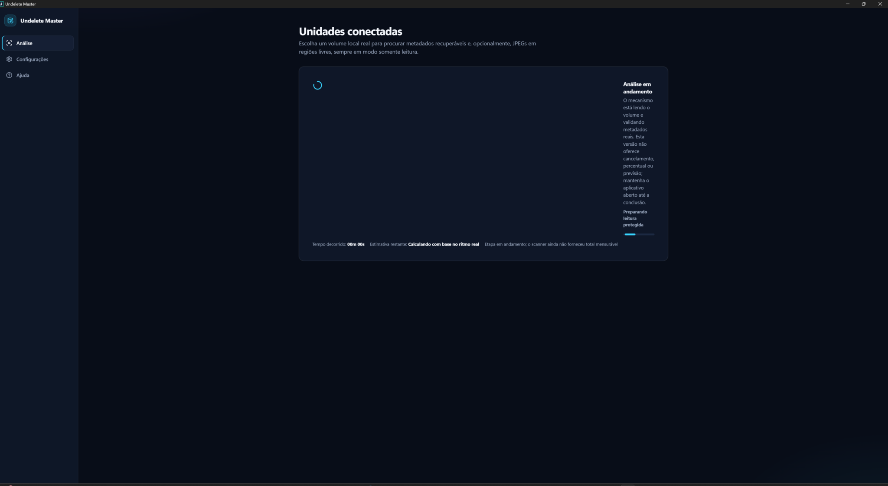
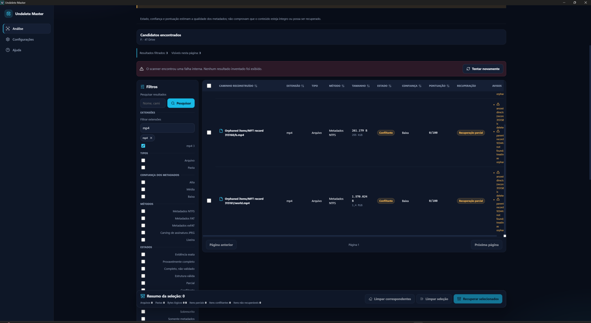
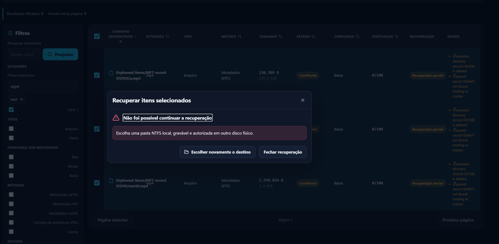

# Real Windows desktop screenshots

This gallery contains only captures of the real Tauri desktop application. No
screen in this directory is a mockup, generated interface or substituted
dataset.

Screenshots have two deliberately separate evidence classes:

- **current packaged capture**: captured directly from the final executable;
- **historical acceptance capture**: supplied during hands-on testing and kept
  because it records the defect that caused a subsequent regression fix.

Visual evidence helps explain the workflow. It does not replace the native
tests, integrity hashes, traceability matrix or a governed end-to-end recovery
run.

## 1. Connected local storage (current packaged build)

The unelevated application inventories actual mounted Windows volumes and
presents drive labels only as display information. A scan uses the opaque
volume identity revalidated by the read-only broker.

Provenance:

- captured: 2026-08-03;
- application commit: `a426b1c`;
- executable: `target/release/undelete-master-desktop.exe`;
- executable SHA-256:
  `A15E1D5CA081D111F5B5C79C4075976A9B94E1AE9F3A96E9FED26B62A0A56CEF`;
- Windows display scale: 150%; application window captured directly with
  `PrintWindow`, without the surrounding desktop;
- image: 1195 x 817, SHA-256
  `8E652468B0EE5D26061D4BB3674993CB2025BF333A9312CED72853EA0E137BB3`.

## 2. Native scan feedback (historical acceptance evidence)

This real acceptance capture recorded the former narrow scan panel and the
initial zero-time/indeterminate behavior. It motivated the request-bound
elapsed timer, measurable MFT percentage/ETA and wide-layout corrections in
`da57f7e`, `58146dc` and the associated `SCAN-PROGRESS-001` regressions. Later
phases remain honestly indeterminate when the scanner cannot supply a trusted
total.

Image: 2048 x 1124, SHA-256
`B4DFD81A2BCEF75D446CAE564FCC59856D3C719187F4F02FA190176A023096D4`.

## 3. Candidate workspace (historical acceptance evidence)

This capture records the real candidate table before the final full-width and
individual-row interaction fixes. The resulting changes made rows clickable,
kept individual checkboxes independent, repaired the responsive table and
preserved an already valid page when a refresh fails (`cbd12b5`, `9fb4b31` and
`636a890`).

Image: 2048 x 1121, SHA-256
`6B2C2E6A3A290ED251996E5ECFB6BDADDB26F5279FFA595ABCC4CAFE1D93A655`.

## 4. Recovery destination diagnostic (historical acceptance evidence)

This capture exposed the former destination-admission failure even when the
operator chose another drive. The corrected implementation resolves the
selected folder through its volume GUID, performs zero-access metadata queries
and admits it only when Windows proves a writable local NTFS destination on a
different physical disk (`636a890`).

Image: 2048 x 1005, SHA-256
`49D6FC69DCC8BDCA6D8D0D2F9C430BE64DE0F191095554A47477BF828C417852`.

## Release-gallery boundary

Images 2-4 are intentionally labeled as defect evidence; they are not marketed
as the final visual state. A future release gallery may replace them only after
a packaged, real-device run captures: measurable scan progress, exactly one
selected candidate, an accepted destination on another physical disk and a
completed restore manifest. Until that run exists, the repository keeps the
evidence truthful instead of staging a fabricated success screen.
