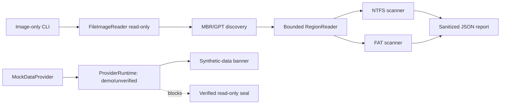

# SDD-016 — Foundation Hardening and Safe Image CLI

Status: Accepted for implementation  
Date: 2026-07-29  
Owner: Undelete Master maintainers  
Parent source of truth: `UNDELETE_MASTER_CODEX_MASTER_SPEC.md`

## 1. Decision summary

This increment strengthens the implemented foundation before expanding raw-device,
restore, carving, or exFAT scope. It delivers:

1. panic-resistant and bounded parser behavior for known hostile-image cases;
2. correct treatment of truncated allocation data, partially initialized NTFS
   streams, and overlapping candidate extents;
3. a real, read-only CLI that scans regular disk-image files through the existing
   NTFS/FAT engines and emits a JSON report;
4. an explicitly labeled desktop demonstration mode that never presents
   synthetic sources or an unverified read-only guarantee as live device state;
5. keyboard/status improvements for the current results and progress views;
6. reproducible Rust/frontend quality gates and SDD evidence.

This is not a production release. It does not add physical-disk access, an
elevated broker, a Tauri shell, real restore, carving, or production exFAT
support.

## 2. Context and evidence

The 2026-07-29 baseline found:

- `cargo test --workspace` passed for the current workspace;
- `cargo fmt --all -- --check` failed on formatting drift;
- `cargo clippy --workspace --all-targets -- -D warnings` failed on a redundant
  FAT branch;
- frontend typecheck and tests passed, but the required `pnpm lint` command did
  not exist;
- GPT, NTFS allocation-map, initialized-stream, sector-layout, and overlapping
  extent paths contained boundedness or correctness risks;
- the desktop application was a Vite demonstration backed unconditionally by
  deterministic synthetic data, while its shell displayed a read-only seal as
  though a source handshake had occurred;
- no repository CI workflow, traceability matrix, risk register, or complete SDD
  set existed;
- the GitHub repository contained only its initial README on `main`, while the
  local engineering history was unrelated and had no configured remote.

UI evidence is stored under `docs/evidence/ui-audit/`.

## 3. Approaches considered

### A. Expand immediately into exFAT and Tauri

This would add visible breadth, but the current exFAT crate is incomplete and the
Tauri/privilege boundary does not exist. Expanding both at once would increase
security and correctness risk while leaving known parser bugs unresolved.

### B. Perform hardening only

This minimizes scope and removes known parser defects, but it leaves no real
end-user entry point over the already implemented image, partition, NTFS, and
FAT components.

### C. Hardening plus a safe image-only CLI and honest desktop prototype

Selected. It closes the known correctness defects, exposes useful recovery
scanning over regular image files without widening privilege, makes the desktop
state truthful, and creates CI/traceability for the delivered behavior.

## 4. Architecture

### 4.1 Parser hardening

- GPT offsets and lengths use checked operations before any comparison or slice.
- `AllocationMap` treats missing backing bytes as unknown, never indexes outside
  its buffer, and reports no allocation certainty for truncated data.
- NTFS extents are split at `initialized_size`; the logical tail is represented
  as sparse zero data even when the split falls inside a physical run.
- invalid sector layouts fail closed; no loop or division may use a zero logical
  sector size.
- candidate coverage is the union of clipped logical intervals, not a raw sum.
  Scoring derives missing bytes from the same normalized coverage model and uses
  saturating accounting for adversarial totals.

### 4.2 Safe image CLI

`crates/cli` is a non-elevated binary and library. It accepts only an existing
regular file with one of these case-insensitive extensions:

```text
.img .dd .raw .bin
```

It opens the path with `FileImageReader`, which requests read access and
explicitly disables write access. It never accepts a device selector, never
creates a writable source handle, and never restores or extracts content.

The CLI discovers MBR/GPT. If no partition table is recognized, it scans the
whole image as one volume. Each bounded volume is tried as NTFS, then FAT.
Recognized scanners return candidate metadata and warnings. An unrecognized
volume is reported, not treated as an error for the whole image.

The stable report is JSON:

```json
{
  "schemaVersion": 1,
  "source": {
    "id": "image:<redacted-path>:<length>",
    "label": "fixture.img",
    "sizeBytes": 1048576
  },
  "partitionTable": "gpt",
  "volumes": [
    {
      "index": 1,
      "offsetBytes": 1048576,
      "lengthBytes": 52428800,
      "fileSystem": "ntfs",
      "candidateCount": 3,
      "warnings": []
    }
  ],
  "warnings": []
}
```

The default JSON must not expose a full source path. Fatal errors are written to
stderr and return a non-zero process exit code.

### 4.3 Desktop trust state

The provider boundary exposes runtime metadata:

```ts
type ProviderMode = "demo" | "tauri";

interface ProviderRuntime {
  mode: ProviderMode;
  readOnlyVerified: boolean;
}
```

The current `MockDataProvider` reports `mode: "demo"` and
`readOnlyVerified: false`. The app displays a persistent, localized
“Demonstração — dados sintéticos” banner. The green read-only seal is displayed
only when `readOnlyVerified` is true; demo mode instead shows an explicitly
unverified status.

Results and restore must not silently substitute `sess-0001` when no session is
active. They render an empty-state action and do not query the provider.

Existing colors, typography, navigation, and screen hierarchy remain unchanged.
This is a trust and operability correction, not a visual redesign.

### 4.4 Accessibility and layout

- sortable result headers use native buttons;
- result rows can be focused and activated with Enter or Space;
- scan and restore progress expose named `progressbar` semantics and restrained
  live status announcements;
- `--text-faint` is raised to AA-compatible contrast for small text;
- the 1100 px minimum desktop viewport keeps primary controls reachable using
  local panel scrolling rather than clipping the entire application.

### 4.5 Quality gates

Pull requests run:

- Rust format, Clippy with warnings denied, and workspace tests;
- frontend deterministic install, lint, typecheck, tests, and build;
- no disk-device or VHD integration test.

CI uses only repository fixtures, memory images, and temporary regular files.

## 5. Requirements

### SDD-HARD-001 — Checked GPT arithmetic

- **Rationale:** hostile image metadata must not panic or wrap offsets.
- **Priority:** Must.
- **Source:** Master spec §§8.3, 10, 21; `AGENTS.md`.
- **Preconditions:** an arbitrary regular image is supplied to partition
  discovery.
- **Behavior:** every GPT table and entry range is formed with checked
  arithmetic and bounded against the source.
- **Error behavior:** invalid or overflowing structures return
  `ScanError::Corrupt`.
- **Security implications:** prevents denial of service and out-of-region reads.
- **Observability:** the CLI reports the scanner error without a backtrace or
  raw data.
- **Acceptance criteria:** overflow fixtures return an error and do not unwind.
- **Test IDs:** `PART-GPT-OVERFLOW-001`, `PART-GPT-RANGE-001`.
- **Implementation links:** `crates/partition/src/gpt.rs`,
  `crates/partition/tests/partition_tables.rs`.
- **Status:** Planned.

### SDD-HARD-002 — Truncated allocation map is unknown

- **Rationale:** a short bitmap cannot prove later clusters allocated or free.
- **Priority:** Must.
- **Source:** Master spec §§11.7, 16; `AGENTS.md`.
- **Preconditions:** the declared cluster count exceeds available bitmap bits.
- **Behavior:** in-range clusters without a backing bit return `None`.
- **Error behavior:** no panic and no fabricated allocation classification.
- **Security implications:** prevents parser denial of service and false
  recoverability claims.
- **Observability:** the NTFS scanner emits a truncation warning.
- **Acceptance criteria:** cluster 63 over a one-byte, 64-cluster map is unknown.
- **Test IDs:** `FS-MAP-TRUNC-001`, `NTFS-BITMAP-TRUNC-001`.
- **Implementation links:** `crates/fs-common/src/lib.rs`,
  `crates/fs-ntfs/src/scan.rs`.
- **Status:** Planned.

### SDD-HARD-003 — Initialized NTFS tail is logical zero

- **Rationale:** bytes beyond `initialized_size` must not expose residual media
  content.
- **Priority:** Must.
- **Source:** Master spec §§11.6, 12.3, 18.4.
- **Preconditions:** `initialized_size < data_size`, including a split within a
  physical extent.
- **Behavior:** physical and sparse extents are split exactly at the initialized
  boundary.
- **Error behavior:** overflow or invalid ranges degrade to bounded partial
  evidence.
- **Security implications:** prevents unintended disclosure of stale bytes.
- **Observability:** candidate extents explain which tail is sparse.
- **Acceptance criteria:** an 8192-byte stream initialized through byte 4608
  yields 4608 physical bytes plus 3584 sparse bytes; extraction returns zeros in
  the tail.
- **Test IDs:** `NTFS-INIT-TAIL-001`.
- **Implementation links:** `crates/fs-ntfs/src/scan.rs`.
- **Status:** Planned.

### SDD-HARD-004 — Valid sector layout

- **Rationale:** zero-size sectors can cause loops or division by zero.
- **Priority:** Must.
- **Source:** Master spec §§8.3, 9.3, 20; `AGENTS.md`.
- **Preconditions:** a caller or hostile reader supplies a sector layout.
- **Behavior:** logical and physical sector sizes must be non-zero and physical
  size must not be smaller than logical size.
- **Error behavior:** invalid layouts fail closed before loops or division.
- **Security implications:** prevents hangs and crashes.
- **Observability:** callers receive an invalid-input or corrupt-layout error.
- **Acceptance criteria:** zero logical sectors cannot enter best-effort I/O or
  partition parsing.
- **Test IDs:** `CORE-SECTOR-VALID-001`, `IO-SECTOR-ZERO-001`,
  `PART-SECTOR-ZERO-001`.
- **Implementation links:** `crates/core/src/source.rs`,
  `crates/io-common/src/lib.rs`, `crates/partition/src/lib.rs`.
- **Status:** Planned.

### SDD-HARD-005 — Union-based candidate coverage

- **Rationale:** duplicate or overlapping extents must not hide missing ranges
  or inflate scores.
- **Priority:** Must.
- **Source:** Master spec §§16.2–16.5.
- **Preconditions:** candidate extents may be overlapping, duplicated, unsorted,
  or partially outside logical size.
- **Behavior:** coverage is computed from the union of clipped logical ranges.
- **Error behavior:** overflow is saturated and cannot raise a score.
- **Security implications:** prevents misleading recoverability results.
- **Observability:** missing byte explanations use normalized coverage.
- **Acceptance criteria:** duplicate `0..50` extents on a 100-byte file report
  50 covered, 50 missing, and the mandatory partial-score cap.
- **Test IDs:** `CORE-COVERAGE-UNION-001`, `CORE-SCORE-OVERLAP-001`.
- **Implementation links:** `crates/core/src/candidate.rs`,
  `crates/core/src/score.rs`.
- **Status:** Planned.

### SDD-CLI-001 — Regular-image-only source

- **Rationale:** expose useful scan functionality without raw-device privilege.
- **Priority:** Must.
- **Source:** Master spec FR-003, FR-033, AC-002, AC-027.
- **Preconditions:** a user supplies a path to a supported regular image file.
- **Behavior:** the CLI opens the image through `FileImageReader` and scans only
  bounded regions.
- **Error behavior:** missing, non-regular, or unsupported-extension paths are
  rejected before scanner invocation.
- **Security implications:** excludes device paths and all writes to the source.
- **Observability:** stderr contains a sanitized error and the process is
  non-zero.
- **Acceptance criteria:** deterministic NTFS and FAT images produce schema
  version 1 reports and expected candidate counts; a `.txt` path is rejected.
- **Test IDs:** `CLI-IMAGE-NTFS-001`, `CLI-IMAGE-FAT-001`,
  `CLI-IMAGE-EXT-001`.
- **Implementation links:** `crates/cli/src/lib.rs`,
  `crates/cli/src/main.rs`, `crates/cli/tests/scan_image.rs`.
- **Status:** Planned.

### SDD-CLI-002 — Privacy-preserving JSON report

- **Rationale:** diagnostics should not leak full local paths by default.
- **Priority:** Must.
- **Source:** Master spec FR-101 and §22.
- **Preconditions:** a scan report is serialized.
- **Behavior:** report source identity contains the image label and size, not
  the full path.
- **Error behavior:** serialization failure returns a non-zero exit.
- **Security implications:** reduces unintended local-path disclosure.
- **Observability:** `schemaVersion` supports future migrations.
- **Acceptance criteria:** serialized output does not contain the temporary
  directory path used by tests.
- **Test IDs:** `CLI-JSON-PRIVACY-001`.
- **Implementation links:** `crates/cli/src/report.rs`.
- **Status:** Planned.

### SDD-UI-001 — Explicit demonstration state

- **Rationale:** synthetic disks and results must never be mistaken for live
  sources.
- **Priority:** Must.
- **Source:** Master spec §§2, 21; `AGENTS.md`.
- **Preconditions:** the mock provider is selected.
- **Behavior:** a persistent localized demo banner is visible and the provider
  reports `readOnlyVerified: false`.
- **Error behavior:** unknown runtime mode fails to an unavailable state, not
  demo data.
- **Security implications:** prevents false assurance.
- **Observability:** runtime mode is visible in the UI and testable.
- **Acceptance criteria:** mock mode displays “dados sintéticos”; the verified
  green seal is absent.
- **Test IDs:** `UI-RUNTIME-DEMO-001`, `UI-SEAL-VERIFY-001`.
- **Implementation links:** `apps/desktop/src/api/provider.ts`,
  `apps/desktop/src/App.tsx`.
- **Status:** Planned.

### SDD-UI-002 — No implicit session fallback

- **Rationale:** opening Results or Restore without a session must not fabricate
  a completed scan.
- **Priority:** Must.
- **Source:** Master spec FR-090–FR-093 and §30.6.
- **Preconditions:** `activeSessionId` is null.
- **Behavior:** Results and Restore show an empty state with an action to choose
  or run a session.
- **Error behavior:** provider result/restore methods are not called.
- **Security implications:** prevents synthetic evidence from appearing real.
- **Observability:** empty state is accessible by heading/status text.
- **Acceptance criteria:** component tests prove no query occurs without a
  session.
- **Test IDs:** `UI-RESULTS-NOSESSION-001`, `UI-RESTORE-NOSESSION-001`.
- **Implementation links:** `apps/desktop/src/views/ResultsView.tsx`,
  `apps/desktop/src/views/RestoreView.tsx`.
- **Status:** Planned.

### SDD-UI-003 — Keyboard and status semantics

- **Rationale:** the primary analysis flow must be operable without a mouse and
  understandable by assistive technology.
- **Priority:** High.
- **Source:** Master spec §§19.9, 27; AC-022.
- **Preconditions:** Results, live scan, or restore progress is displayed.
- **Behavior:** sort actions are buttons, result rows support focus and
  Enter/Space, and progress exposes named status.
- **Error behavior:** keyboard activation does not toggle selection implicitly.
- **Security implications:** none beyond preventing accidental actions.
- **Observability:** semantic roles and values are visible to tests.
- **Acceptance criteria:** keyboard component tests cover sorting/opening and
  progress is queryable by role.
- **Test IDs:** `UI-RESULTS-KEYBOARD-001`, `UI-PROGRESS-ARIA-001`.
- **Implementation links:** `apps/desktop/src/views/ResultsView.tsx`,
  `apps/desktop/src/views/LiveScanView.tsx`,
  `apps/desktop/src/views/RestoreView.tsx`.
- **Status:** Planned.

### SDD-QA-001 — Reproducible local and CI gates

- **Rationale:** completion claims require fresh, repeatable evidence.
- **Priority:** Must.
- **Source:** `AGENTS.md`; master spec §§23.7, 28, 30.
- **Preconditions:** repository dependencies are installed from committed
  lockfiles.
- **Behavior:** required Rust and frontend commands exist locally and in CI.
- **Error behavior:** any warning, lint issue, type error, failing test, or build
  failure blocks the workflow.
- **Security implications:** CI never accesses real devices.
- **Observability:** GitHub Actions retains command logs.
- **Acceptance criteria:** all required commands exit zero on the final tree.
- **Test IDs:** `QA-RUST-GATES-001`, `QA-WEB-GATES-001`.
- **Implementation links:** `apps/desktop/package.json`,
  `.github/workflows/quality.yml`.
- **Status:** Planned.

## 6. Data flow



## 7. Error handling

- Parser errors are values, not panics.
- A corrupt partition or volume does not grant a broader read range.
- One unrecognized volume does not invalidate other bounded volumes.
- CLI fatal errors do not print recovered content or full source paths.
- Desktop demo mode remains functional for UI development, but cannot imply a
  live scan or verified source.
- Async UI errors introduced within this increment are surfaced as accessible
  status/alert text; no promise rejection is silently ignored in changed paths.

## 8. Testing strategy

All behavior changes follow red-green-refactor:

1. write a regression test that fails for the demonstrated defect;
2. run the smallest relevant test and record the expected failure;
3. implement the minimum bounded behavior;
4. rerun the focused test and relevant crate/component suite;
5. run the full required gates before commit.

Only deterministic fixtures, memory images, and temporary regular files are
permitted. No physical disk or device path is used.

## 9. Delivery and rollback

The work lands on `codex/foundation-hardening`. The GitHub `main` history is
preserved and incorporated without force-push. If integration cannot be made
fast-forward-safe, the branch is pushed without moving `main` and the exact
blocker is reported.

Rollback is a normal revert of the increment commits. No data migration,
installer, raw-device configuration, or external deployment is involved.

## 10. Known exclusions

- Windows physical drive enumeration and broker/UAC boundary;
- Tauri commands and production desktop packaging;
- extraction or restore writes;
- carving and validators;
- exFAT scanning;
- NTFS compression, non-resident attribute lists, full ADS recovery, and
  `$MFTMirr` fallback;
- resumable session database;
- production release, installer, signing, SBOM, or completion report.

