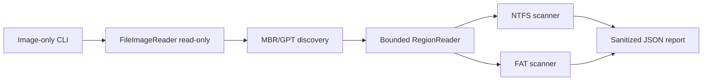

# SDD-016 — Foundation Hardening and Safe Image CLI

Status: Parser and image-CLI requirements verified on the frozen code tree;
quality/CI and superseded UI scope remain partial or not started
Date: 2026-07-29  
Owner: Undelete Master maintainers  
Parent source of truth: `UNDELETE_MASTER_CODEX_MASTER_SPEC.md`

> **Historical supersession notice:** the parser, reader, score, and safe-image
> CLI portions remain applicable. Every demonstration-provider/UI direction in
> this document was rejected before release and is superseded by
> [SDD-017](017-real-only-image-desktop.md) and
> [ADR-0021](../adr/0021-real-only-image-desktop.md). The production app
> contains no mock/demo provider or fabricated domain state. Historical mock UI
> screenshots were deleted because they are not evidence for the current app.

## 1. Decision summary

The portions of this increment that remain applicable strengthen the
implemented foundation before expanding raw-device, restore, carving, or exFAT
scope. They deliver:

1. panic-resistant and bounded parser behavior for known hostile-image cases;
2. atomic GPT copy validation; correct treatment of truncated or capped
   allocation data, bounded NTFS/FAT completeness, partially initialized
   streams, and overlapping candidate extents;
3. a real, read-only CLI that scans regular disk-image files through the existing
   NTFS/FAT engines and emits a JSON report;
4. reproducible Rust/frontend quality gates and SDD evidence.

An earlier revision also proposed a labeled desktop demonstration provider and
UI work over fabricated sessions/results. That proposal was rejected, was not
delivered as current product functionality, and is wholly superseded by
[SDD-017](017-real-only-image-desktop.md). It is retained below only as
historical decision context.

This is not a production release. It does not add physical-disk access, an
elevated broker, a Tauri shell, real restore, carving, or production exFAT
support.

## 2. Context and evidence

The 2026-07-29 baseline found:

- `cargo test --workspace` passed for the current workspace;
- `cargo fmt --all -- --check` failed on formatting drift;
- `cargo clippy --workspace --all-targets -- -D warnings` failed on a redundant
  FAT branch;
- frontend typecheck and tests passed, but the required `pnpm lint` command did
  not exist;
- GPT, NTFS allocation-map, initialized-stream, sector-layout, and overlapping
  extent paths contained boundedness or correctness risks;
- the desktop application was a Vite demonstration backed unconditionally by
  deterministic synthetic data, while its shell displayed a read-only seal as
  though a source handshake had occurred;
- no repository CI workflow, traceability matrix, risk register, or complete SDD
  set existed;
- the GitHub repository contained only its initial README on `main`, while the
  local engineering history was unrelated and had no configured remote.

The historical UI evidence was removed after the real-only decision because it
depicted unsupported fabricated workflows.

## 3. Approaches considered

### A. Expand immediately into exFAT and Tauri

This would add visible breadth, but at that baseline the exFAT crate was
incomplete and the Tauri/privilege boundary did not exist. Expanding both at
once would increase security and correctness risk while leaving known parser
bugs unresolved.

### B. Perform hardening only

This minimizes scope and removes known parser defects, but it leaves no real
end-user entry point over the already implemented image, partition, NTFS, and
FAT components.

### C. Historical option: hardening, safe image-only CLI, and a desktop prototype

This option was selected in the original draft, then rejected for desktop
delivery when the product owner prohibited fabricated application behavior.
Only its parser-hardening, image-only CLI, and governance portions remain
applicable. Its provider and prototype UI direction is superseded by SDD-017
and must not be implemented or restored.

## 4. Architecture

### 4.1 Parser hardening

- GPT offsets and lengths use checked operations before any comparison or
  slice. A copy is accepted only when its header and entry table validate
  together. The backup lives only at the final logical block, points back to
  LBA 1, and keeps its entries in reserved metadata space. Both canonical
  copies are evaluated even when the primary is usable; if both headers are
  valid, reciprocal locations and shared metadata must agree. Primary
  read/header/table failure permits the independently valid canonical backup,
  and protective `0xEE` MBR entries are never returned when neither copy is
  usable.
- `AllocationMap` treats missing backing bytes as unknown, never indexes outside
  its buffer, and reports no allocation certainty for truncated data. NTFS
  limits the `$Bitmap` read and backing allocation to 64 MiB; the suffix remains
  unknown and a warning records the bound.
- NTFS exposes structural completeness. MFT work caps, a shortened trusted
  physical prefix, a nonblank record without a `FILE` signature, skipped
  unreadable/torn/corrupt records, malformed attributes in ordinary/extension
  records, unresolved `$ATTRIBUTE_LIST` dependencies, or extension-record merge
  failures make the scan incomplete and survive report adaptation. Because the
  current merge pass does not prove all references and candidate-defining
  attributes resolved, any `$ATTRIBUTE_LIST`, even a well-formed resident one,
  keeps the scan incomplete. An unaligned `$MFT.data_size`, one covering fewer
  than all 16 reserved record slots, or malformed record-0 attributes fails as
  corrupt before enumeration.
- FAT exposes structural completeness. The BPB permits one through four total
  copies; divergent or unreadable declared secondary copies,
  broken/cyclic/unreadable directory traversal, unusable directory start
  clusters, and directory count/byte/depth/chain bounds produce a partial
  returned scan with warnings. The 8 MiB-derived cluster-count limit bounds a
  directory chain before reading its clusters. A declared FAT table above
  64 MiB fails as corrupt before table allocation.
- NTFS extents are split at `initialized_size`; the logical tail is represented
  as sparse zero data even when the split falls inside a physical run.
- invalid sector layouts fail closed; no loop or division may use a zero logical
  sector size.
- candidate coverage is the union of clipped logical intervals, not a raw sum.
  Scoring derives missing bytes from the same normalized coverage model and uses
  saturating accounting for adversarial totals.

### 4.2 Safe image CLI

`crates/cli` is a non-elevated binary and library. It accepts only an existing
regular file with one of these case-insensitive extensions:

```text
.img .dd .raw .bin
```

It opens the path with `FileImageReader`, which requests read access and
explicitly disables write access. It never accepts a device selector, never
creates a writable source handle, and never restores or extracts content.

The CLI discovers MBR/GPT. It scans the whole image as one volume only when
partition discovery returns `NotRecognized`; a recognized corrupt/read failure
remains an error. Each bounded volume is tried as NTFS, then FAT only when NTFS
returns `NotRecognized`. A recognized scanner's `Read` or `Corrupt` error
becomes a typed `CliError::VolumeScan` and cannot be masked by another parser.
An unrecognized volume is reported, not treated as an error for the whole
image.

The stable report is JSON:

```json
{
  "schemaVersion": 2,
  "source": {
    "id": "image:<redacted-path>:<length>",
    "label": "fixture.img",
    "sizeBytes": 1048576
  },
  "partitionTable": "gpt",
  "volumes": [
    {
      "index": 1,
      "offsetBytes": 1048576,
      "lengthBytes": 52428800,
      "fileSystem": "ntfs",
      "scanStatus": "complete",
      "candidateCount": 3,
      "warnings": []
    }
  ],
  "warnings": []
}
```

Every volume has a required `scanStatus`: `complete` for recognized exhaustive
enumeration, `partial` for recognized NTFS or FAT when that scanner reports a
known coverage boundary, or `unrecognized` only when no supported filesystem
recognizes the region. A partial count is a bounded observed count, not an
exhaustive total.

The default JSON must not expose a full source path. Fatal errors are written
to stderr and return a non-zero process exit code.

### 4.3 Historical desktop trust-state proposal — rejected and superseded

This subsection records a discarded design and has no present normative force.
The historical provider boundary would have exposed:

```ts
type ProviderMode = "demo" | "tauri";

interface ProviderRuntime {
  mode: ProviderMode;
  readOnlyVerified: boolean;
}
```

The rejected `MockDataProvider` would have reported `mode: "demo"` and
`readOnlyVerified: false`, accompanied by a persistent synthetic-data banner
and no verified read-only seal. The discarded proposal also would have removed
an implicit `sess-0001` fallback.

None of that provider, runtime type, session/results/restore flow, banner, or
fabricated state is allowed in the current application. The production desktop
instead has one real Tauri-to-CLI path and fails closed without it, as governed
by SDD-017 and ADR-0021.

### 4.4 Historical prototype accessibility proposal — superseded

The rejected prototype plan would have added keyboard handling, progress
semantics, contrast changes, and layout corrections to its fabricated results,
scan, and restore screens. Those fabricated screens remain absent; the current
product instead has real native scan/results authority and the actionable
restore workflow governed by [SDD-010](010-ux-ui-and-accessibility.md),
SDD-017, [SDD-018](018-windows-volume-and-folder-scan.md), and
[SDD-020](020-actionable-results-and-transactional-restore.md). This historical
list is not evidence for the implemented desktop or its still-unverified
packaged real-device acceptance.

### 4.5 Quality gates

Pull requests run:

- Rust format, Clippy with warnings denied, and workspace tests;
- frontend deterministic install, lint, typecheck, tests, and build;
- no disk-device or VHD integration test.

CI uses only repository fixtures, memory images, and temporary regular files.

## 5. Requirements

### SDD-HARD-001 — Atomic, checked GPT copy validation

- **Rationale:** hostile image metadata must not panic or wrap offsets.
- **Priority:** Must.
- **Source:** Master spec §§8.3, 10, 21; `AGENTS.md`.
- **Preconditions:** an arbitrary regular image is supplied to partition
  discovery.
- **Behavior:** every GPT table and entry range is formed with checked
  arithmetic and bounded against the source. Header and entry table validate
  atomically. Only the final logical block is considered as backup; topology,
  reciprocal pointers, usable range, disk GUID, entry geometry/CRC, and
  reserved metadata placement are validated as applicable. Both canonical
  copies are evaluated; two valid but inconsistent headers fail closed even
  when the primary table is usable. Primary header read failure also permits
  canonical backup-copy evaluation.
- **Error behavior:** invalid or overflowing structures return
  `ScanError::Corrupt`. If neither GPT copy is usable, a protective `0xEE` MBR
  is never surfaced as an ordinary data partition.
- **Security implications:** prevents denial of service and out-of-region reads.
- **Observability:** the CLI reports the scanner error without a backtrace or
  raw data.
- **Acceptance criteria:** overflow fixtures return an error and do not unwind;
  a valid canonical backup recovers a corrupt primary table or unreadable
  primary header; an interior redirected or nonreciprocal backup is rejected;
  conflicting valid headers fail closed; unusable copies with a protective MBR
  fail closed without exposing type `0xEE`.
- **Test IDs:** `PART-GPT-OVERFLOW-001`, `PART-GPT-RANGE-001`,
  `PART-GPT-BACKUP-001`, `PART-GPT-BACKUP-002`,
  `PART-GPT-BACKUP-003`, `PART-GPT-BACKUP-004`,
  `PART-GPT-BACKUP-005`,
  `PART-GPT-PROTECTIVE-001`.
- **Implementation links:** `crates/partition/src/gpt.rs`,
  `crates/partition/tests/partition_tables.rs`.
- **Status:** Verified.

### SDD-HARD-002 — Truncated or capped allocation map is unknown

- **Rationale:** a short bitmap cannot prove later clusters allocated or free.
- **Priority:** Must.
- **Source:** Master spec §§11.7, 16; `AGENTS.md`.
- **Preconditions:** the declared cluster count exceeds available bitmap bits,
  or the NTFS `$Bitmap` stream exceeds 64 MiB.
- **Behavior:** the scanner reads and allocates at most 64 MiB for `$Bitmap`;
  in-range clusters without a retained backing bit return `None`.
- **Error behavior:** no panic and no fabricated allocation classification.
- **Security implications:** prevents parser denial of service and false
  recoverability claims.
- **Observability:** the NTFS scanner emits a bounded truncation/cap warning.
- **Acceptance criteria:** cluster 63 over a one-byte, 64-cluster map is
  unknown; an oversized declared bitmap cannot cause a read or allocation over
  64 MiB, and suffix bits remain unknown.
- **Test IDs:** `FS-MAP-TRUNC-001`, `NTFS-BITMAP-TRUNC-001`,
  `NTFS-BITMAP-BOUND-004`.
- **Implementation links:** `crates/fs-common/src/lib.rs`,
  `crates/fs-ntfs/src/scan.rs`.
- **Status:** Verified.

### SDD-HARD-003 — Bounded filesystem completeness and initialized NTFS tail

- **Rationale:** bytes beyond `initialized_size` must not expose residual media
  content, and a bounded or malformed metadata traversal must not be called
  exhaustive.
- **Priority:** Must.
- **Source:** Master spec §§11.6, 12.3, 18.4.
- **Preconditions:** `initialized_size < data_size`, including a split within a
  physical extent; `$MFT` has an invalid logical size or enumeration reaches a
  known evidence/work boundary; or FAT directory enumeration reaches a known
  corruption/read/safety boundary.
- **Behavior:** physical and sparse extents are split exactly at the initialized
  boundary. `NtfsScanOutput::is_complete` becomes false for an MFT work cap, a
  shortened trusted physical prefix, a nonblank record without a `FILE`
  signature, skipped unreadable/torn/corrupt records, malformed attributes in
  ordinary/extension records, any not-fully-proven `$ATTRIBUTE_LIST`
  dependency, or an extension-record offset/read/parse failure.
  `FatScanOutput::is_complete` becomes false for divergent/unreadable declared
  secondary copies, broken/cyclic/unreadable directory traversal, unusable
  directory start clusters, or directory count/byte/depth/chain bounds.
- **Error behavior:** record-unaligned `$MFT.data_size`, or an aligned value
  below `FIRST_USER_RECORD` (16) record slots, and malformed record-0
  attributes return `ScanError::Corrupt`; recoverable enumeration bounds
  produce a returned partial scan. A FAT table above 64 MiB is rejected before
  allocation. Fatal first-FAT-copy/root reads remain typed errors.
- **Security implications:** prevents unintended disclosure of stale bytes and
  false exhaustive-enumeration claims.
- **Observability:** candidate extents explain which tail is sparse; structural
  completeness and warnings propagate through the CLI and desktop report.
- **Acceptance criteria:** an 8192-byte stream initialized through byte 4608
  yields 4608 physical bytes plus 3584 sparse bytes; extraction returns zeros in
  the tail. Invalid MFT logical sizes are rejected; a nonblank non-`FILE` record
  or malformed candidate attributes are partial; any `$ATTRIBUTE_LIST` remains
  partial until full reference and candidate-defining-attribute resolution is
  proven; capped MFT or FAT directory scans are structurally partial, and their
  candidate counts are not described as exhaustive.
- **Test IDs:** `NTFS-INIT-TAIL-001`, `NTFS-MFT-BOUND-003`,
  `NTFS-SPARSE-MFT-005`, `NTFS-MFT-SIZE-001`,
  `NTFS-RECORD-SIGNATURE-001`, `NTFS-ATTRIBUTE-BOUNDS-001`,
  `NTFS-ATTRIBUTE-LIST-PARTIAL-001`,
  `FAT-COMPLETENESS-001`,
  `FAT-COMPLETENESS-002`, `FAT-COMPLETENESS-003`,
  `FAT-COMPLETENESS-004`, `FAT-TABLE-BOUND-001`,
  `FAT-DEPTH-BOUND-001`, `FAT-DIRECTORY-CHAIN-BOUND-001`,
  `CLI-IMAGE-FAT-PARTIAL-001`, `DESKTOP-CANDIDATE-001`,
  `WIN-PARTIAL-UNKNOWN-001`.
- **Implementation links:** `crates/fs-ntfs/src/scan.rs`,
  `crates/fs-fat/src/scan.rs`, `crates/cli/src/lib.rs`.
- **Status:** Verified.

### SDD-HARD-004 — Valid sector layout

- **Rationale:** zero-size sectors can cause loops or division by zero.
- **Priority:** Must.
- **Source:** Master spec §§8.3, 9.3, 20; `AGENTS.md`.
- **Preconditions:** a caller or hostile reader supplies a sector layout.
- **Behavior:** logical and physical sector sizes must be non-zero and physical
  size must not be smaller than logical size.
- **Error behavior:** invalid layouts fail closed before loops or division.
- **Security implications:** prevents hangs and crashes.
- **Observability:** callers receive an invalid-input or corrupt-layout error.
- **Acceptance criteria:** zero logical sectors cannot enter best-effort I/O or
  partition parsing.
- **Test IDs:** `CORE-SECTOR-VALID-001`, `IO-SECTOR-ZERO-001`,
  `PART-SECTOR-ZERO-001`.
- **Implementation links:** `crates/core/src/source.rs`,
  `crates/io-common/src/lib.rs`, `crates/partition/src/lib.rs`.
- **Status:** Verified.

### SDD-HARD-005 — Union-based candidate coverage

- **Rationale:** duplicate or overlapping extents must not hide missing ranges
  or inflate scores.
- **Priority:** Must.
- **Source:** Master spec §§16.2–16.5.
- **Preconditions:** candidate extents may be overlapping, duplicated, unsorted,
  or partially outside logical size.
- **Behavior:** coverage is computed from the union of clipped logical ranges.
- **Error behavior:** overflow is saturated and cannot raise a score.
- **Security implications:** prevents misleading recoverability results.
- **Observability:** missing byte explanations use normalized coverage.
- **Acceptance criteria:** duplicate `0..50` extents on a 100-byte file report
  50 covered, 50 missing, and the mandatory partial-score cap.
- **Test IDs:** `CORE-COVERAGE-UNION-001`, `CORE-SCORE-OVERLAP-001`.
- **Implementation links:** `crates/core/src/candidate.rs`,
  `crates/core/src/score.rs`.
- **Status:** Verified.

### SDD-CLI-001 — Regular-image-only source

- **Rationale:** expose useful scan functionality without raw-device privilege.
- **Priority:** Must.
- **Source:** Master spec FR-003, FR-033, AC-002, AC-027.
- **Preconditions:** a user supplies a path to a supported regular image file.
- **Behavior:** the CLI opens the image through `FileImageReader`, scans only
  bounded regions, falls through only on `NotRecognized`, and emits
  schema-version-2 reports with required per-volume `scanStatus`.
- **Error behavior:** missing, non-regular, or unsupported-extension paths are
  rejected before scanner invocation. Recognized parser `Read` and `Corrupt`
  failures remain typed `VolumeScan` errors and are not relabeled as
  unrecognized.
- **Security implications:** excludes device paths and all writes to the source.
- **Observability:** stderr contains a sanitized error and the process is
  non-zero.
- **Acceptance criteria:** deterministic NTFS and FAT images produce schema
  version 2 reports with valid status/filesystem combinations and expected
  candidate counts; an incomplete FAT scan preserves `partial`; a `.txt` path
  is rejected; a recognized parser failure remains a sanitized error.
- **Test IDs:** `CLI-JSON-PRIVACY-001`, `CLI-IMAGE-FAT-001`,
  `CLI-IMAGE-EXT-001`, `CLI-IMAGE-REGULAR-001`,
  `CLI-IMAGE-DEVICE-PATH-001`, `CLI-IMAGE-FAT-PARTIAL-001`,
  `CLI-PROBE-ERROR-PRIVACY-001`.
- **Implementation links:** `crates/cli/src/lib.rs`,
  `crates/cli/src/main.rs`, `crates/cli/tests/scan_image.rs`.
- **Status:** Verified.

### SDD-CLI-002 — Privacy-preserving JSON report

- **Rationale:** diagnostics should not leak full local paths by default.
- **Priority:** Must.
- **Source:** Master spec FR-101 and §22.
- **Preconditions:** a scan report is serialized.
- **Behavior:** report source identity contains the image label and size, not
  the full path. Schema version 2 requires a structurally valid per-volume
  `scanStatus`.
- **Error behavior:** serialization failure returns a non-zero exit.
- **Security implications:** reduces unintended local-path disclosure.
- **Observability:** `schemaVersion` supports future migrations; status and
  warnings preserve bounded-coverage truth.
- **Acceptance criteria:** serialized output does not contain the temporary
  directory path used by tests.
- **Test IDs:** `CLI-JSON-PRIVACY-001`,
  `CLI-PROCESS-ERROR-PRIVACY-001`,
  `CLI-PROBE-ERROR-PRIVACY-001`, `CLI-IMAGE-FAT-PARTIAL-001`.
- **Implementation links:** `crates/cli/src/report.rs`.
- **Status:** Verified.

### SDD-UI-001 — Historical demonstration-state proposal (superseded)

- **Rationale:** the rejected proposal attempted to distinguish synthetic disks
  and results from live sources; current production forbids them entirely.
- **Priority:** Must.
- **Source:** Historical draft only; superseded by SDD-017 and ADR-0021.
- **Preconditions:** none in the current product; a mock provider is prohibited.
- **Behavior:** this historical demonstration behavior must not be implemented
  or restored. Current production contains no demo provider, synthetic banner,
  fabricated state, or fallback dataset.
- **Error behavior:** current unknown/non-Tauri runtime fails closed with no
  data under the real-only requirements in SDD-017.
- **Security implications:** supersession removes the false-assurance surface
  instead of merely labeling it.
- **Observability:** current source/bundle inventories must show the historical
  provider and its types absent.
- **Acceptance criteria:** SDD-017 `REAL-AC-001` and `REAL-AC-002` replace the
  discarded demo-mode acceptance.
- **Test IDs or formal justification:** `JUST-SDD-UI-001-UNVERSIONED`.
- **Implementation links:** none; this superseded requirement has no permitted
  implementation.
- **Status:** Not started.

### SDD-UI-002 — Historical session-fallback proposal (superseded)

- **Rationale:** the rejected prototype could fabricate a completed session.
  Current production implements a separate real native results/restore
  workflow under SDD-020 but still has no fabricated or persistent session
  fallback.
- **Priority:** Must.
- **Source:** Historical draft only; superseded by SDD-017's unsupported-flow
  requirement.
- **Preconditions:** none in the current product; no active-session contract is
  exposed.
- **Behavior:** this historical empty-state/provider proposal must not be
  implemented. Current production has no session provider or fallback
  identifier. Its results and restore commands operate only on retained native
  scan/selection/destination/plan/job authority defined by SDD-020.
- **Error behavior:** unsupported routes/commands remain absent and cannot
  synthesize a session.
- **Security implications:** omission prevents synthetic evidence from
  appearing real.
- **Observability:** current route and command inventories prove the historical
  session/demo surfaces absent while separately enumerating the real SDD-020
  surface.
- **Acceptance criteria:** SDD-017 `REAL-AC-006` replaces this discarded
  prototype acceptance.
- **Test IDs or formal justification:** `JUST-SDD-UI-002-UNVERSIONED`.
- **Implementation links:** none; this superseded requirement has no permitted
  implementation.
- **Status:** Not started.

### SDD-UI-003 — Historical prototype keyboard/status proposal (superseded)

- **Rationale:** the rejected results/progress/restore prototype needed keyboard
  and status semantics.
- **Priority:** High.
- **Source:** Historical draft only; current accessibility is governed by
  SDD-010, SDD-018 and SDD-020.
- **Preconditions:** none in the current product; the referenced fabricated
  prototype screens are absent.
- **Behavior:** this requirement does not authorize restoring prototype
  results, progress, or restore screens. Current real-only accessibility is
  specified and tested against the actual mounted-volume, actionable-results
  and transactional-restore workflows.
- **Error behavior:** no historical keyboard behavior is claimed.
- **Security implications:** prevents an accessibility statement from implying
  that unsupported workflows exist.
- **Observability:** only current real-only controls and statuses count as
  evidence.
- **Acceptance criteria:** current SDD-010/018/020 acceptance replaces the
  discarded prototype cases.
- **Test IDs or formal justification:** `JUST-SDD-UI-003-UNVERSIONED`.
- **Implementation links:** none; this superseded requirement has no permitted
  implementation.
- **Status:** Not started.

### SDD-QA-001 — Reproducible local and CI gates

- **Rationale:** completion claims require fresh, repeatable evidence.
- **Priority:** Must.
- **Source:** `AGENTS.md`; master spec §§23.7, 28, 30.
- **Preconditions:** repository dependencies are installed from committed
  lockfiles.
- **Behavior:** required Rust and frontend commands exist locally and in CI.
- **Error behavior:** any warning, lint issue, type error, failing test, or build
  failure blocks the workflow.
- **Security implications:** CI never accesses real devices.
- **Observability:** GitHub Actions retains command logs.
- **Acceptance criteria:** all required commands exit zero on the final tree.
- **Test IDs:** `CI-SAFETY-INLINE-001`,
  `CI-SAFETY-PACKAGE-LIFECYCLE-001`, `CI-SAFETY-SHEBANG-001`,
  `CI-SAFETY-INVOKED-HELPER-001`, `CI-SAFETY-INVOKED-HELPER-002`,
  `CI-SAFETY-INVOKED-HELPER-003`, `CI-SAFETY-INVOKED-HELPER-004`,
  `CI-SAFETY-INVOKED-HELPER-005`, `CI-SAFETY-INVOKED-HELPER-006`,
  `CI-SAFETY-INVOKED-HELPER-007`, `CI-SAFETY-INVOKED-HELPER-008`,
  `CI-SAFETY-INVOKED-HELPER-009`, `CI-SAFETY-INVOKED-HELPER-010`,
  `CI-SAFETY-INVOKED-HELPER-011`, `CI-SAFETY-INVOKED-HELPER-012`,
  `CI-SAFETY-WORKFLOWS-001`,
  `DOCS-CATALOG-001`, `DOCS-REQUIREMENT-SETS-001`,
  `DOCS-STATUS-SYNC-001`, `DOCS-ACTUAL-TEST-001`,
  `DOCS-ACTUAL-TEST-003`, and `DOCS-CODE-PATH-001`.
- **Implementation links:** `.github/workflows/quality.yml`,
  `.github/scripts/validate_ci_safety.py`,
  `.github/scripts/validate_docs.py`.
- **Status:** Partial.

## 6. Data flow



The rejected demo-provider flow is intentionally absent from this applicable
data-flow diagram. Current desktop flow is specified only in SDD-017.

## 7. Error handling

- Parser errors are values, not panics.
- A corrupt partition or volume does not grant a broader read range.
- One unrecognized volume does not invalidate other bounded volumes.
- CLI fatal errors do not print recovered content or full source paths.
- The rejected desktop demo/provider mode is removed and must not remain
  functional, even for production UI development.
- Current desktop error and accessibility behavior is governed by SDD-017; this
  document makes no present-tense claim for the historical prototype.

## 8. Testing strategy

All behavior changes follow red-green-refactor:

1. write a regression test that fails for the demonstrated defect;
2. run the smallest relevant test and record the expected failure;
3. implement the minimum bounded behavior;
4. rerun the focused test and relevant crate/component suite;
5. run the full required gates before commit.

Only deterministic fixtures, memory images, and temporary regular files are
permitted. No physical disk or device path is used.

## 9. Delivery and rollback

The work lands on `codex/foundation-hardening`. The GitHub `main` history is
preserved and incorporated without force-push. If integration cannot be made
fast-forward-safe, the branch is pushed without moving `main` and the exact
blocker is reported.

Rollback is a normal revert of the increment commits. No data migration,
installer, raw-device configuration, or external deployment is involved.

## 10. Known exclusions

- Windows physical drive enumeration and broker/UAC boundary;
- within the historical SDD-016 scope, Tauri commands and production desktop
  packaging (the later real-only implementation is governed by SDD-017);
- extraction or restore writes;
- carving and validators;
- exFAT scanning;
- NTFS compression, non-resident attribute lists, full ADS recovery, and
  `$MFTMirr` fallback;
- resumable session database;
- production release, installer, signing, SBOM, or completion report.
