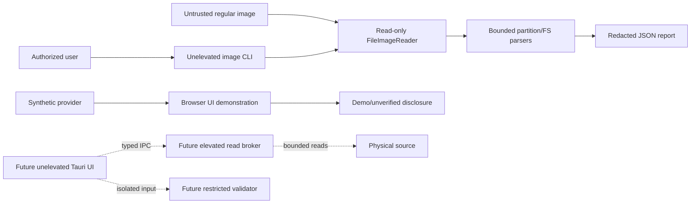

# Threat Model

Status: Initial model; review required before privileged or restore work

## Scope

This model covers the current regular-image foundation and target process
boundaries. The elevated broker, sandbox worker, Tauri shell, session import,
restore, and installers are not implemented; their threats remain open rather
than accepted.

## Data flow and trust boundaries

Trust boundaries are: untrusted image to reader/parser, parser result to
report/UI, future unelevated-to-elevated IPC, future recovered content to worker,
and future candidate path to destination filesystem.

## STRIDE register

| Threat | Boundary/component | Impact | Required mitigation | Test/evidence | State |
| --- | --- | --- | --- | --- | --- |
| Spoofed source identity | Image/device resume | Wrong source data attributed to a session. | Stable identity and revalidation before resume/restore. | AC-015; device identity tests. | Open |
| Broker client spoofing/replay | Future IPC | Unauthorized privileged reads. | SID ACL, nonce, parent/session binding, replay protection, allowlist. | Unauthorized/malformed IPC tests. | Not started |
| Source tampering by application | Reader/broker | Destruction of recoverable evidence. | No write API, read-only handles, no lock/dismount/trim. | ADR-0002, AC-002. | Partial |
| Report/path information disclosure | CLI/logs/session | Local paths or private names leak. | Default redaction, no content/secrets, manual diagnostic export. | CLI redaction and log tests. | Partial |
| Parser denial of service | Untrusted image | Panic, hang, excessive allocation, out-of-range read. | Checked arithmetic, bounded loops/queues, property/fuzz tests. | SDD-HARD tests; fuzz pending. | Partial |
| Recovered-content execution | Preview/OS | Malware executes with user/admin rights. | Never execute; restricted networkless worker; safe renderers only. | Worker escape/crash and UI tests. | Not started |
| Path traversal/reparse race | Future restore | Write escapes approved destination. | Sanitization, handle-based containment, no reparse following. | AC-029 and race tests. | Not started |
| Score/content repudiation | Candidate/report | Product cannot explain or reproduce a claim. | Factorized score, provenance, hashes, immutable evidence. | ADR-0006 and score tests. | Partial |
| Supply-chain substitution | Build/release | Compromised dependency/artifact. | Lockfiles, review, audit/deny, SBOM, signing and hashes. | Release pipeline evidence. | Open |
| CI privilege escalation | Pull request | Untrusted PR reaches device or signing secret. | Hosted unprivileged jobs, read-only token, no device tests/secrets. | CI safety validator. | Implemented-unverified |

## Residual risk

Synthetic fixtures and static workflow inspection cannot prove Windows broker,
AppContainer, reparse-race, installer, or real-media behavior. Those are release
blockers, not accepted residual risks.

