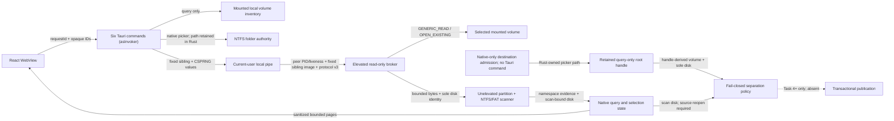

# Threat Model

Status: Current for SDD-018 and the implemented Task 1-3 slice of SDD-020;
final native/package/security evidence pending

## Scope

This model covers the unelevated Tauri desktop, mounted-volume inventory,
native NTFS folder authority, protocol-v3 broker client, short-lived elevated
broker, read-only mounted-volume source, unelevated partition/filesystem
parsers, candidate adaptation, native query/selection state, bounded restore
planning/streaming primitives, the query-only native destination capability,
physical-disk separation policy and React rendering.

The image CLI remains a separate read-only path. Destination picker/coordinator
registration, capability retention/expiry, transactional publication, restore
jobs, preview, exFAT, persistent sessions, whole-physical-disk scans and
unmounted sources are absent.

## Data flow and trust boundaries

The logical group is outside source authority and has no physical disk number.
Unelevated inventory uses no DASD/IOCTL mapping. The elevated source open and
native destination admission derive a single authoritative disk number only
through fixed query-only volume extents and storage-property calls. Production
does not open `PhysicalDriveN`, and disk number plus bus classification is not
hardware attestation.

Primary trust boundaries are WebView/native IPC, unelevated/elevated pipe,
display inventory/authoritative open, mutable volume/read session, native
folder/NTFS namespace, native picker path/retained destination handle,
handle/derived-volume identity, scan/reopen/destination disk policy, untrusted
metadata/DTO and DTO/React rendering.

## STRIDE register

| Threat | Boundary | Impact | Current mitigation | Residual / required evidence | Status |
| --- | --- | --- | --- | --- | --- |
| Spoofed broker peer | Native client to pipe | Privileged read oracle or redirected session | Fixed sibling, restrictive one-instance pipe, bidirectional PID/liveness, broker-side `QueryFullProcessImageNameW` equality with the canonical fixed desktop sibling, v3 sequences and exact nonce echo | Image-path equality reduces confused-deputy exposure but is not publisher/package authentication; Authenticode, protected-directory and same-revision native evidence remain pending | Open |
| Broker binary replacement | Package to process launch | Attacker receives elevated execution | The launcher derives the fixed broker sibling internally; the genuine broker checks the desktop sibling image before service; no UI executable path | A replaced broker can ignore its own peer check, and a user-replaceable sibling directory defeats path-only identity; Authenticode, hash binding, protected installation and clean-machine evidence pending | Open |
| Protocol replay/confusion | Pipe framing | Wrong command/result applied | Fixed 20-byte header, exact v3 with v2 rejected, independent contiguous sequences, closed ten-message schema | Final full suite and fuzz campaign pending | Mitigating |
| Privilege expansion | Protocol/native boundary | Write, arbitrary path or generic control under elevation | No mutation/path/access-mask/control field; fixed query-only IOCTLs; one private top-level canonical import plus exactly five bare non-macro audited `CreateFileW` shapes; raw, qualified, public, aliased, macro-wrapped, `link_name`, extra extern and dynamic-resolution routes fail closed; the sole extern is exact `ShellExecuteExW`; exact root/io-windows/Tauri dependency inventories, workspace-only first-party child dependencies, first-party proc-macro rejection, Cargo patch/source-substitution rejection, and a closed io-windows macro invocation/rebinding inventory block direct or transitive token synthesis; resolved-package checks block renamed loader dependencies; scan source alone uses `GENERIC_READ`; destination volume uses desired access `0` | Static source validation passes; built-binary import/access-mask evidence remains pending | Open |
| Stale volume substitution | Inventory to open/read | Wrong source scanned | Stable GUID+serial ID; UAC; independent broker canonical length/extents/mapping and fixed direct-bus checks on the currently mounted source | An exact GUID+serial clone is indistinguishable at first open; post-open extents/length/geometry/bus become that source's baseline; live volume remains mutable and no snapshot is claimed | Open |
| Destination namespace substitution | Native picker path to retained root | Future writes target an object other than the admitted directory | Open the exact root query-only with no delete sharing and final-reparse no-follow; query directory identity and final volume from that handle; require serial agreement; retain and later consume that handle instead of reopening the path | A race before the initial open can change which object is admitted, although policy applies to the object actually opened; native picker/user-intent evidence, coordinator revalidation, bounded retention and capability-relative publication remain pending | Open |
| False physical separation or bus spoof | Source scan/reopen and destination admission | Restore overwrites still-recoverable source bytes | Require known single-disk source-at-scan, source-at-restore and destination identities; require source equality and destination inequality; reject missing, multi-disk, virtual/file-backed, Storage Spaces, array/network, unknown and future bus values; disk zero remains valid | Windows disk numbers are session-scoped OS identities. A VHD/VHDX normally reports an untrusted virtual/file-backed bus and is rejected, but a hypervisor, driver or malicious storage stack can advertise ATA/SATA/USB/NVMe. This policy is fail-closed classification, not proof of distinct physical hardware; disposable allowlisted VHD and native hardware evidence remain pending | Partial |
| Identity change between reads | Mutable volume | Mixed or misleading result | Re-enumerate after both 256 valid reads and one second; every accepted read still reaches `ReadFile` | Not a snapshot; change between cadence points remains possible | Open |
| Out-of-range/oversized read | Protocol to source | Escape, allocation or denial of service | Checked `offset + length`, source-length bound, 1 MiB cap, client chunking, one source | Hostile live-device campaign pending | Mitigating |
| Source mutation by application | Broker to volume | Destroyed recoverable evidence | Read-only trait, `GENERIC_READ`, no mutation opcode or storage-changing IOCTL | Final static/native binary evidence pending | Open |
| False folder containment | Folder picker to namespace | Wrong candidates attributed to folder | Native NTFS identity: volume serial + record/sequence; exact active-directory resolution; trivalent ancestry | External NTFS corpus and native selection evidence pending | Mitigating |
| Path disclosure | Native to WebView/log | Private path/device information exposed | Commands use opaque IDs; absolute folder/device/pipe paths and raw OS errors remain native | Final artifact/log marker scan pending | Mitigating |
| Recovered-text spoofing | Parser to UI | Visually misleading path/warning | Bounded text, control/bidi formatting removal, React text nodes and directional isolation | Unicode confusables and native visual review remain | Mitigating |
| Parser memory/CPU denial | Volume bytes to parser | Hang, panic or excessive allocation | Unelevated `spawn_blocking`, checked arithmetic, region/work/allocation limits, bounded DTO; NTFS per-name path saturation is checked before another recursive sibling descent | `NTFS-NAMESPACE-WORK-BOUND-001` reduces the synthetic case from 8,191 calls to at most 600, but no cooperative cancellation and fuzz/performance corpora remain pending | Partial |
| False completeness | Parser/filter to UI | User treats partial count as exhaustive | NTFS/FAT status/warnings retained; unknown ancestry separate; score not a guarantee | Native presentation and external corpus pending | Mitigating |
| Fabricated production state | Browser/UI data path | User trusts nonexistent scan | Browser fails closed; exact six commands; no production sample/fallback/timer result | Final bundle/static inspection pending | Mitigating |
| Recovered-content execution | Candidate UI | Malware executes | No preview, open, execute, restore or Explorer action | Future feature requires a new threat model | Not started |
| Destructive test | CI/local tests | Real media damaged | Synthetic images/readers only; static CI/device guard | Static analysis is defense in depth; final validator run pending | Mitigating |
| Unsigned artifact quarantine | Release | User disables protection or trusts altered binary | Event remains unresolved; no false-positive claim; release requires signing and exact hashes | Norton disposition, Authenticode and clean-machine evidence pending | Open |

## Protocol security facts

- `HelloAck` echoes the exact 32-byte CSPRNG client nonce.
- The client comparison is constant-time.
- The echo binds the response to this connection but provides no shared-secret
  authentication.
- Native peer identity combines PID/liveness with
  `QueryFullProcessImageNameW` on the already-bound handle and exact canonical
  equality to the fixed desktop sibling.
- Peer image-path equality is not Authenticode, publisher, package-revision or
  protected-directory authentication.
- Protocol v3 permits exactly `Hello`, `HelloAck`, `OpenSource`, `Opened`,
  `ReadAt`, `ReadData`, `CloseSource`, `Closed`, `Shutdown` and `Error`.
- Maximum payload/read is 1 MiB.
- One session opens at most one source.

## Privacy facts

No account, cloud, analytics or telemetry is required. Only locale, theme and
reduced-motion preferences persist. Native folder/source authorities and scan
results live in bounded memory. The Task 3 destination handle, final volume
GUID and disk number remain native and have no Tauri DTO or command. Candidate
bytes never enter JavaScript.

## Residual risk and acceptance boundary

The current implementation is not a forensic snapshot, signed release or proof
of broad real-media compatibility. An exact volume clone that preserves GUID
plus serial cannot be distinguished at first broker open. A direct-bus value
and unequal Windows disk numbers do not prove distinct physical hardware when
the hypervisor, driver or storage stack is adversarial. The destination
capability is query-only and is not yet wired to a retained coordinator or
transactional publisher. Namespace-budget saturation remains explicitly
partial/unknown rather than complete evidence. No real volume was scanned for
this evidence. Final local gates, static guards, native
binaries/manifests/hashes, actual Tauri accessibility, remote CI, external
corpora, disposable allowlisted VHD rejection, Authenticode,
administrator-protected installation, clean-machine and endpoint-security
disposition remain pending.

Norton’s deletion of an unsigned development build is inconclusive. Temporary
local protection state is not a mitigation and must not be generalized into a
release instruction.
