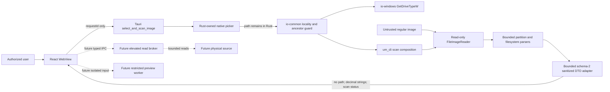

# Threat Model

Status: current for the real-only image desktop; review required before device,
restore or preview work

## Scope

This model covers the unelevated Tauri desktop, regular-image CLI, read-only
file reader and bounded partition/filesystem parsers. The future elevated
broker, sandbox worker, restore process, session import and installer remain
outside the implemented boundary.

## Data flow and trust boundaries

Trust boundaries are untrusted image to reader/parser, native path to the
Rust-only command and locality guard, parser-controlled text to DTO/WebView,
and future unelevated-to-elevated or recovered-content boundaries.

## STRIDE register

| Threat | Boundary/component | Impact | Implemented mitigation | Remaining test/evidence | State |
| --- | --- | --- | --- | --- | --- |
| Source tampering by application | Reader/command | Recoverable evidence is destroyed. | No write API; read-only regular-file open; no device command; source SHA-256 parity test. | Future broker runtime proof. | Mitigating |
| WebView supplies a device/path | IPC | Host opens an unintended source. | Command accepts request ID only; picker lives in Rust; `um_cli` revalidates the path. | Broader Windows namespace corpus. | Mitigating |
| Remote or redirected source is treated as local | Rust path boundary | Network-controlled bytes or a junction target are scanned. | `io-windows` classifies drive-letter roots with read-only `GetDriveTypeW`; remote/error results fail closed; `io-common` rejects every symlink/reparse ancestor and validates the final read-only handle. | External Windows namespace corpus and deterministic concurrent mutation tests. | Mitigating |
| Source replacement between picker, locality checks, ancestor checks and open | Picker to reader | Different bytes are analyzed or a local path is redirected. | One Rust command minimizes the interval; final open does not follow a final reparse point and validates handle metadata. | Retained ancestor/source handles and stable file/volume identity; the current pathname sequence is not race-free. | Open |
| Path/error disclosure | Rust DTO/WebView | Sensitive local path leaks. | Basename-only report; stable error codes; raw error ignored; unique-marker tests. | Packaged log inspection. | Mitigating |
| Bidirectional text spoofing | Parser/source label to WebView | A filename or warning appears visually reordered. | Rust removes Unicode bidi formatting controls before IPC; React renders text nodes, and the source heading uses `<bdi dir="auto">`. | Frozen-code regressions passed; native visual review remains pending, Unicode confusables remain possible, and labels are display-only. | Mitigating |
| Numeric truncation | Rust/JavaScript IPC | Wrong offset/count is presented. | Decimal strings, strict regex and `BigInt`. | Cross-platform boundary corpus. | Mitigating |
| Parser denial of service | Untrusted image | Panic, hang or excessive allocation. | Checked arithmetic, bounded reads/work, 64 MiB NTFS `$Bitmap` cap, MFT work limits, FAT table rejection above 64 MiB before allocation, and FAT directory count/byte/depth/chain limits applied before directory reads, plus report limits and `spawn_blocking`. | Frozen-code full suites pass; fuzz and performance campaigns plus cooperative cancellation remain open. | Partial |
| Incomplete metadata coverage is presented as exhaustive | NTFS/FAT parser, report and UI | A bounded candidate count is mistaken for the total and recovery decisions become misleading. | NTFS marks work/prefix/skipped-record/signature/malformed-candidate-attribute/merge boundaries partial and keeps every `$ATTRIBUTE_LIST` partial until complete reference and candidate-defining-attribute resolution is proven; FAT marks every declared secondary-copy disagreement/read failure plus directory chain/cycle/start/read/count/byte/depth boundaries partial; schema 2 preserves partial for either recognized filesystem and the UI displays a coverage caveat. | Frozen-code gates pass; external NTFS/FAT corpora and native UI acceptance remain pending. | Mitigating |
| Recognized parser corruption is masked by fallback | Partition/filesystem composition | Corrupt GPT/NTFS/FAT data appears unrecognized, complete, or as a protective-MBR volume. | GPT accepts header plus table atomically, always evaluates both canonical locations, reads backup only at final LBA, rejects conflicting valid headers, validates reciprocal/consistent metadata and reserved entry areas, permits an independently valid backup after primary read/header/table failure, and never surfaces `0xEE` when both copies fail. NTFS requires an aligned logical MFT spanning all 16 reserved record slots and well-formed record-0 attributes. FAT rejects a declared table above 64 MiB before allocation. Filesystem and whole-image fallback occur only on `NotRecognized`; typed `Read`/`Corrupt` errors map to stable codes. | Frozen-code full suite passed; hostile external-corpus evidence remains pending. | Mitigating |
| Fabricated evidence | UI/runtime | User mistakes generated state for scan output. | One invoke; browser fails closed; no production provider/timer; CI real-only guard. | Same-revision packaged smoke and remote CI. | Mitigating |
| WebView command abuse | Capability/commands | Shell, filesystem, network or privileged host action. | One app command, empty capability permissions, no privileged plugins, local production CSP; development `devCsp` and the dev-only served-HTML transform add only the fixed `ws://localhost:1420` live-reload origin, while production output stays WebSocket-free. | Final packaged capability/CSP inventory and native acceptance. | Mitigating |
| Recovered-content execution | Future preview | Malware executes. | Preview and individual content are absent. | Restricted worker design/tests. | Not started |
| Path traversal/reparse race | Future restore | Write escapes destination. | Restore is absent. | Handle-based containment and race tests. | Not started |
| Supply-chain substitution | Build/release | Compromised dependency/artifact. | Cargo/pnpm lockfiles, pinned Tauri versions, audit and CI hashes. | SBOM, signing and provenance. | Open |
| Endpoint-security alert is dismissed without resolution | Build/release | A compromised or low-reputation artifact is distributed. | Norton deletion is classified as unresolved; the development build is unsigned and redistribution is blocked. | Vendor classification, signed clean-machine artifact, Authenticode and reproducible provenance. | Open |
| CI device access | Pull request | Test damages a disk. | Managed runners, deny environment and static storage guard. | Independent runtime isolation proof. | Mitigating |

## Independent security-review snapshot

Codex Security scan
`ebdb9b62-f405-4e5b-837a-f58937dec74b` was sealed at
`2026-07-29T21:26:36.951973Z` for working-tree snapshot
`codex-security-snapshot/v1:sha256:b48534c24ce25c4d2799081366d5d970402bbcc226fd6f460be806c89f34a0b3`
with base/head
`3b08141ae521fd0992bac06ef2f79eb0c576cff6`. It contains `34/34` unique
review receipts. Three candidates were technically validated—ancestor/path
TOCTOU, picker-to-open TOCTOU, and bidi display formatting—and each received a
final policy decision of `ignore`, leaving zero reportable findings.

That outcome is a reportability result for the sealed snapshot, not proof that
the repository has no vulnerabilities. The technically valid TOCTOU candidates
remain in this threat model. The later bidi mitigation's frozen-code tests pass,
while native visual acceptance remains pending. The local report is
non-portable and may be removed by
temporary-file cleanup:
`C:\Users\fscar\AppData\Local\Temp\codex-security-scans-nnlDPh\Undelete-Master\3b08141ae521fd0992bac06ef2f79eb0c576cff6_20260729T205644Z_4tn30ko4\report.md`.
Its measured SHA-256 is
`F4DA89BCED64BDF8CB1295182351DE77CF4E3D76B56191782138D7BCA50381FC`.
See the retained
[desktop evidence record](../evidence/real-only-desktop-2026-07-29.md).

## Residual risk

Synthetic fixtures and static inspection cannot prove compatibility with all
real media or hostile filesystems. The current executable is an image analyzer,
not a production recovery release. A `partial` recognized NTFS or FAT result is
intentionally non-exhaustive even when all observed candidates are valid.
Pathname validation is not a chain-of-custody guarantee. Device, restore,
preview, final
same-revision gates, native accessibility, signing, endpoint-classification
resolution, and external-corpus evidence remain release blockers.
